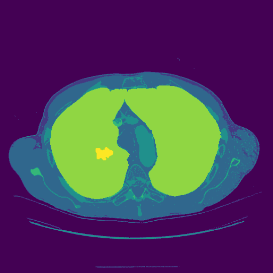

# LIDC-IDRI-Semantic-Processing
To create the Semantic Label Map of lung CT images from LIDC-IDRI dataset.

# What's different compared to other repositories?
Most of the repositories focus on only the ROI regions like lung and nodule for segmentation or augmentation, while this repository aims to depict the semantic image of lung CT images, for which will be fed into GANs to reconstruct the lung CT images. This given notebook is the preprocessing algorithm for creating semantic images of medical CT images.

# Processing Steps
1. Read DICOM Files
2. Rescale and add the Intercept based
3. Segmentation class 1~4 based on HU value
4. Create the mask for class 5 (lung) by Find_Contour method
5. Create the mask for class 6 (nodule) by given annotation

To be noted, for the sake of resolution, resampling is not applied since it basically decreases the size and loses the details.

# Description of Depicted Semantic Image
1. The lung CT images are divided based on HU into 4 Catogries: Body, Tissues, Bones/Organs and Hign Intensity Parts
2. Class number 5 is Lung. It is depicted based on Find_Contour Methods in order to preserve the find detail of previous class labels.
3. Class number 6 is Nodule. It is depicted based on annotation by experienced radiologist.
4. To be noted, this algorithm is capable to threshold the annotation based on the amount of annotation (maximum 4, default threshold is set to 2).

